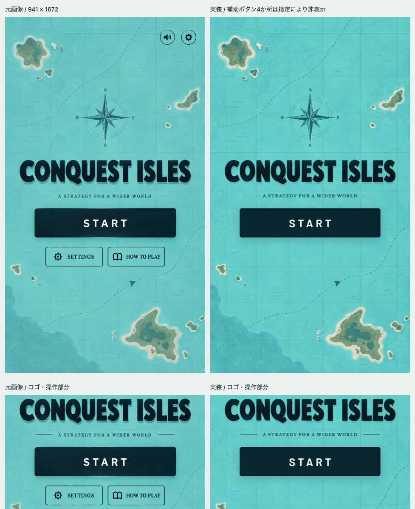

# Conquest Isles トップ画面の比較・検証 — 2026年9月13日

**最終結果：合格**

元画像の海図・ロゴ・配色・STARTの配置を再現しました。追加の指定に合わせ、右上のサウンド・設定と、下段のSETTINGS・HOW TO PLAYの4か所を一時的に非表示にしています。対応が必要な重大度 P0〜P2 の指摘は残っていません。

## 比較対象と画像

- 元画像：[ユーザー提供のデザイン](assets/title/title_reference.png)（941 × 1672ピクセル）。提供時のファイル名は `conquest_isles_top.png`。
- 実装：[トップ画面](lib/ui/title_screen.dart)。
- 同じサイズで描画した画面：[最終版](design-qa-assets/isles-title/reference-size-final.png)。
- 全体と操作部分を並べた画像：[元画像と実装の比較](design-qa-assets/isles-title/comparison-final.png)。
- ブラウザでの表示：[390 × 844](design-qa-assets/isles-title/web-title-390.png)、[320 × 568](design-qa-assets/isles-title/web-title-320.png)、[1440 × 900](design-qa-assets/isles-title/web-title-wide.png)。
- コメント時と同じ表示領域：[442 × 964・補助ボタン非表示後](design-qa-assets/isles-title/web-title-actions-hidden.png)。比較画像と各サイズの画面は、すべて補助ボタンの非表示後に更新しました。

## 比較条件

- 元画像と実装の画像は、ともに941 × 1672ピクセルです。実装は同じ論理サイズのFlutter画面を `toImage(pixelRatio: 1)` で描画しました。同梱フォントと画像の読み込み後に、通常の影を有効にして撮影しています。
- 比較画像では、元画像と実装を50%の大きさで横に並べ、下段にロゴ・キャッチコピー・ボタン部分を同じ範囲で切り出しています。Codexのアプリ内ブラウザで、表示領域977 × 1196、デバイスピクセル比1として確認しました。
- 比較時の状態は、起動直後のタイトル画面です。ダイアログは閉じ、ボタンにマウスポインターを重ねていません。
- Web版は既存の390:844の縦長表示領域を維持しています。小画面・横長画面では、この比率に応じた収まりを確認しました。地図は背景全体を覆い、ロゴは元の縦横比を保ちます。

## 確認結果

| 観点 | 確認した内容 |
| --- | --- |
| 文字・書体 | `CONQUEST ISLES` は元画像の字形と影を利用しています。`START` はBarlow SemiBold、キャッチコピーはLibre Baskerville Boldを使用し、太さ・文字間隔・文字幅を調整しました。フォントとOFLライセンスを同梱しています。 |
| 配置・余白 | 幅941ピクセルでは、ロゴの切り出し位置をy=666、開始ボタンを幅667・y≈898に合わせています。補助ボタンの非表示後もロゴとSTARTの位置を保ちます。操作領域の高さは48論理ピクセル以上です。画面の高さが足りない場合はスクロールで対応します。 |
| 色・質感 | 青緑の海図、濃紺のロゴと操作部分、白い開始ボタンの文字、細い枠線と影を合わせています。背景は元画像を編集して島・コンパス・格子・航路を残し、ロゴ周辺の青緑色は描画時に透過処理しています。 |
| 画像 | 地図は元の解像度のPNG、ロゴは元画像の範囲を指定して表示しています。開始ボタン・文字・読み上げ・フォーカス表示はFlutterの部品として実装しています。 |
| 表示文言 | `CONQUEST ISLES`、`A STRATEGY FOR A WIDER WORLD`、`START` を元画像に合わせています。開始ボタンの読み上げは日本語・英語に対応します。 |
| 操作 | STARTから既存の対戦設定を開けます。指定された4つの補助ボタンは画面とアクセシビリティの操作対象に含まれません。 |

## 比較で見つかった差と修正

1. **P2：ロゴの影が薄い。**
   [初回の描画](design-qa-assets/isles-title/reference-size-first.png)を確認し、透過処理で不透明に保つ色の範囲を広げました。同じサイズで再描画した[最終比較](design-qa-assets/isles-title/comparison-final.png)で修正を確認しました。初回の撮影ではテスト環境で影のぼかしが無効になっていたため、最終画像では通常の影を有効にしています。
2. **指定による変更：4つの補助ボタンを一時的に非表示。**
   ブラウザコメントの4か所に従い、右上のサウンド・設定と下段のSETTINGS・HOW TO PLAYを表示対象から外しました。元画像との差は意図した変更です。ロゴ・キャッチコピー・STARTの配置を保ち、320 × 568から1440 × 900まで表示を確認しました。

## 操作・実装の検証

- 非表示後のアプリ内ブラウザで「START → 対戦設定 → 8島を選択 → タイトルへ戻る → START → 8島の選択が保持されていることを確認」を実施しました。
- 442 × 964の画面で4つの補助ボタンが消え、アクセシビリティ上のボタンが「はじめる」だけになったことを確認しました。
- 小画面・横長画面を確認し、最終ビルドのブラウザの警告・エラーは検出されませんでした。
- 非表示変更前には、カウントダウンから[対戦開始後の画面](design-qa-assets/isles-title/web-playing.png)まで確認しています。
- 非表示後のFlutterの全193テストが成功しました。設定保持、タイトル遷移、画面端の安全領域、文字拡大、アプリの一時停止・復帰、対戦動作を含みます。タイトル画面は7テストです。
- `fvm flutter analyze --no-pub`：問題なし。
- `fvm flutter build web --release --no-pub`：成功。
- `fvm flutter build ios --simulator --debug --no-pub`：補助ボタンの非表示変更前に成功。今回の非表示変更後はiOSビルドを再実行していません。起動したiOSシミュレータ上での操作確認も行っていません。
- 画像再現部分のコードレビューで重要指摘なし。今回の非表示変更は差分を確認しました。

## 残る軽微な差と制約

- **P3：表面の質感。** 開始ボタンは濃紺の単色と影で表現し、元画像にあるごく薄い色むらは再現していません。編集した背景にも細かな質感の差があります。
- 既存アプリには音楽・効果音がありません。設定・サウンド・遊び方の補助ボタンは現在非表示です。
- 元画像にないフォーカス、マウスポインターを重ねた状態、読み上げは、既存Flutterアプリの操作に合わせています。

## 完了項目

- [x] 指定画像を既存Flutterアプリのトップ画面に再現。
- [x] 地図・ロゴの元画像・フォント・ライセンスを同梱。
- [x] 操作を接続し、設定保持とアプリの一時停止・復帰を維持。
- [x] 全体と細部を同じ条件で比較し、P2の差を修正。
- [x] 小画面・横長画面、ブラウザ操作、テスト、解析、ビルドを確認。

<!-- final result: passed -->
