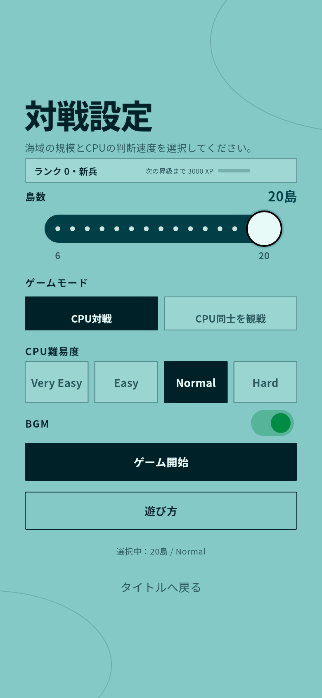
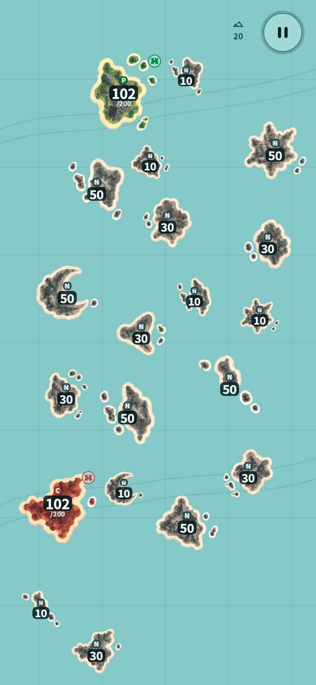
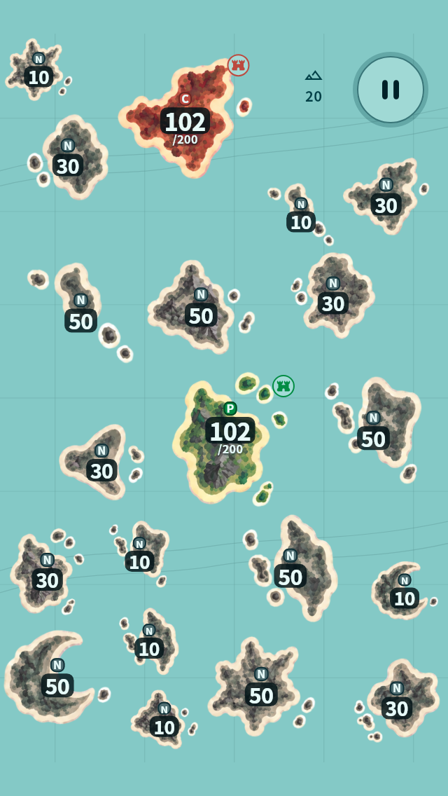

# Issue #119 verification

This is a provisional 20-island maximum for playtesting; the final maximum remains a product decision. The initial selection remains 10.

## Scope

- Select every integer from 6 through 20 with a PR #107-style slider
- Preserve the 10-island default and existing 6/8/10/12 compositions
- Extend neutral sizes by large, large, small, small, medium, medium
- Keep full-size island controls, independent seeded placement and collision checks
- Add bounded suffix retries for maps above 12 islands and reject impossible area envelopes early
- Use the full Safe Area on compact portrait Web layouts when 390:844 fitting would otherwise remove width; keep wide/landscape Web letterboxing

## Verification

Flutter 3.44.8 through the repository's FVM configuration:

```sh
fvm dart format --output=none --set-exit-if-changed lib test integration_test
fvm flutter analyze
fvm flutter test
fvm flutter build web --release --base-href /
```

Coverage includes every allowed count on five viewport sizes over 40 seeds each (3,000 generated maps); exact composition fixtures; same-seed dense-map reproduction; bounded repair and impossible-area behavior; both game modes; start, dispatch, rematch; title/tutorial return; slider taps, drag, keyboard and Semantics; reduced motion; and English/Japanese large text. Twelve additional compact-HUD cases exercise both modes and languages at 1×/2×/3× text scale, including summary Semantics, long-press and pause disclosure.

Full-app 20-island checks include a 320×568 phone with 24px top/bottom Safe Area (actual board 320×520), the same case with Web layout enabled, and a 768×1024 native tablet. The rendered island controls are checked against their actual board bounds and one another. Independent comparison of 800 existing-preset seeded maps found exact equality with the base implementation.

Local result: all 460 tests passed, formatting and analysis clean, release Web build successful.

## Rendered evidence

These are real Flutter widget-engine renders of the application, using the bundled fonts and island assets, a deterministic seed and a manual game loop. Audio is stubbed in this capture harness. They are not physical-device or browser screenshots.

```sh
fvm flutter test --no-pub tool/island_count_capture.dart
fvm flutter test --no-pub --dart-define=SMALL_PHONE=true --dart-define=WEB_LAYOUT=true tool/island_count_capture.dart
```

The optional `CONQUEST_CAPTURE_DIR` environment variable selects another output directory. The default is this directory. `ISLAND_COUNT` defaults to 20 and can be passed as a Dart define.





## Dense-map HUD

At 13–20 islands, an island icon and count sit entirely within the existing pause-control reservation. The complete mode/difficulty/count summary is available through hover/long-press, Semantics and the pause sheet. The 6–12 HUD remains unchanged. This avoids the previously observed dense-map title overlap without changing any map coordinates or reducing island sizes.



## Limits

Physical iOS/Android operation and native screen-reader testing were not performed. Automated Semantics, keyboard, pointer and layout checks do not substitute for that device testing. Very small or landscape-constrained windows that cannot safely fit full-size islands retain the existing fail-closed start/resize behavior.
