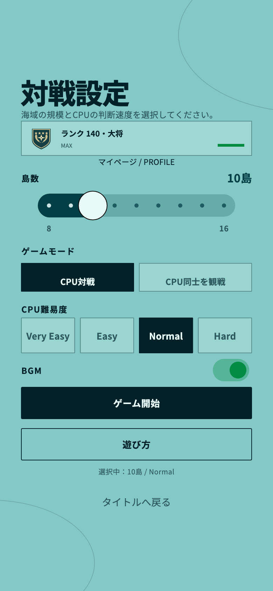
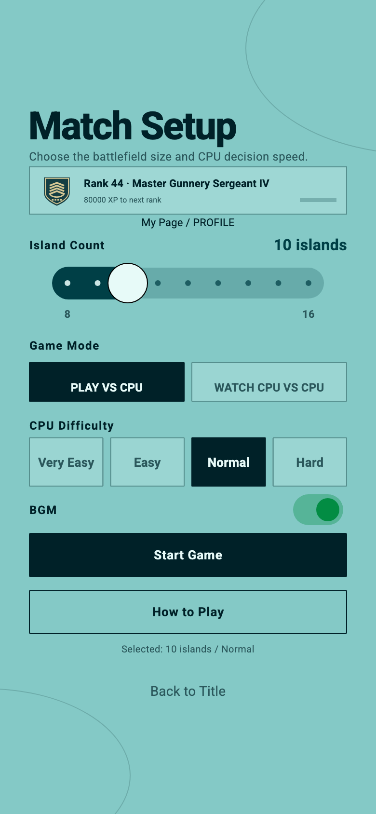
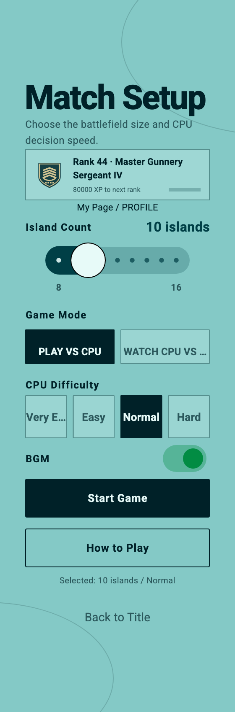
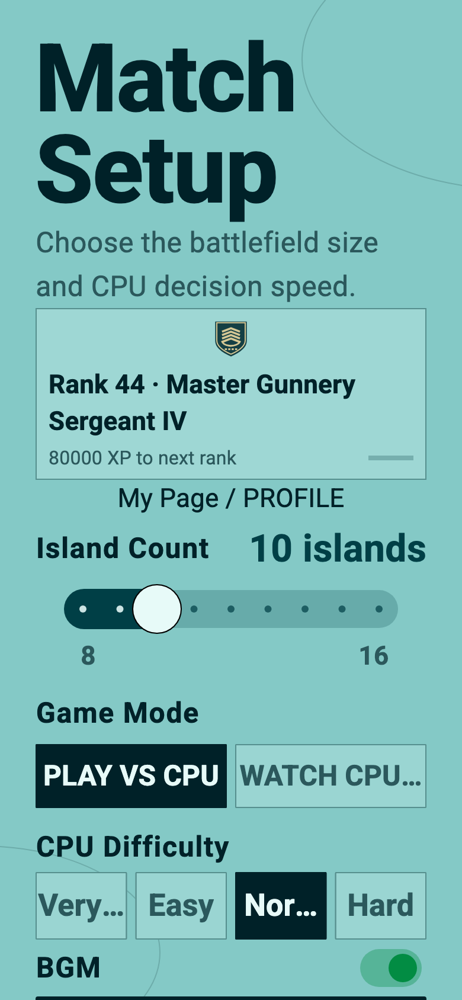
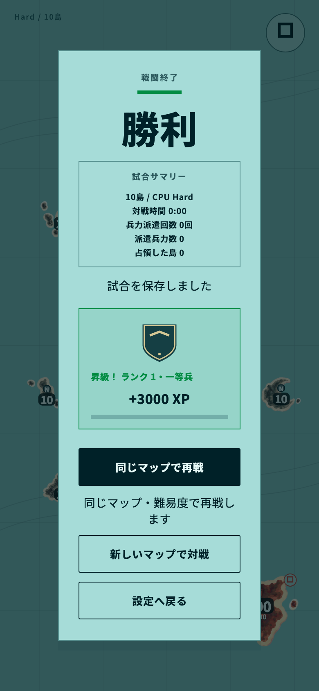
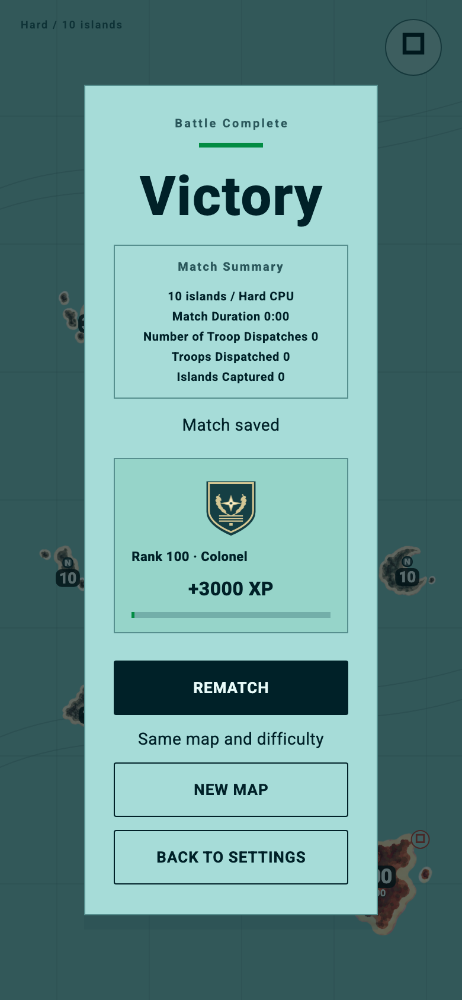

# Issue #124 — 承認済みC案の製品実装

## 承認・PR構成

- ユーザー通知: 2026-10-04 02:30 UTCに「見た目ok」「推奨C案を採用し製品実装を進める」に明示承認。
- [PR #150](https://github.com/yuto90/conquest/pull/150) を**未マージのままDraftへ戻して拡張**。main向けの同一PRであり、別PRへの依存も、#150の先行マージ前提もない。マージ・mainへの直接push・本番公開は行わない。
- 比較時点: [76ad721](https://github.com/yuto90/conquest/commit/76ad72192f663e309e45e79de96fd4a2f396562d)。着手時の最新mainは `bee2d95`。比較コード、比較テスト、比較画像・測定JSONはこのコミットのまま保存。旧文書に状態更新の注記だけを追加した。
- 比較のみ: `tool/rank_badge_study/` / `test/rank_badge_study_test.dart` / [比較文書](issue-124.md)。製品差分の確認は `git diff 76ad721..HEAD`。

## PoCから製品コードへの差分

| 比較PoC | 製品実装 |
| --- | --- |
| `BadgeMethod` A/B/Cを切替 | Cのみ。A/B切替・比較exporterを製品コードへ持ち込まない |
| `BadgeSpec` | `lib/ui/rank_badge_spec.dart` の `RankBadgeSpec`。既存Catalogから境界・段階数を取得 |
| `StudyBadge` / `BadgePainter` | `lib/ui/rank_badge.dart` の共通 `RankBadge` / `RankBadgeLabel` / `RankBadgePainter` |
| テストから手渡す `ui.Image` | ローカルPNGをFlutter `Image.asset`で解決。共通AssetImageキーでキャッシュ・所有権・破棄をFlutterへ委譲 |
| 隔離した設定・結果カード見本 | `home.dart` の既存 `_RankProgressCard` と `_RankAwardSummary` に接続 |
| 比較PNGはアプリasset未登録 | 製品用の共有紋章PNG **1点だけ** `pubspec.yaml` に登録 |
| 外部画像読み込みなし | 引き続き外部通信なし、新規依存なし、アプリ起動時の全階級先読みなし |

枠・単純形・グループ装飾・段階マークはコード描画。Rank 91–140のcommand/general系列だけ、共有オリジナル紋章を合成する。base → 紋章 → detailsの3層でPoCの描画順序を維持。未読込・欠落・デコード失敗では中央紋章だけを幾何図形へ戻し、枠・グループ装飾・段階・寸法は維持する。

141枚の画像や26枚のグループ画像、別XP表、別保存データは追加していない。グループ内の5個マークは**描画上の行容量**であって、階級を一律5段階に分ける計算ではない。

| ランク | グループ数 | 段階数 |
| --- | --- | --- |
| 0 | 1 | 1 |
| 1–50 | 10 | 各5 |
| 51–75 | 5 | 各5 |
| 76–90 | 3 | 各5 |
| 91–109 | 3 | 5 / 4 / 10 |
| 110–139 | 3 | 各10 |
| 140 | 1 | 1 |

## UI・既存ルールの維持

- 設定カードは36dp、結果は56dp。Rank 0/140も番号と階級名を併記する。
- 長い英語名は省略せず折り返す。内部幅が `badgeSize + 130dp` 未満、または対象フォントの文字倍率が1.3倍を超える場合はバッジを上段へ移す。設定ではXP/バーをラベル下の補助領域に配置。
- 500dp以下の高さでは設定の2つのセクション間隔を16→4dpにし、36dpの階級章追加後も280×500画面の難易度・開始ボタンを画面内に維持。操作領域は縮小しない。既存のスクロール、My Pageリンク、設定項目・文言・開始処理は維持。
- 結果の追加表示は **`xpAwarded > 0` の既存領域内かつ `totalXpAfter != null`** に限定。`RankProgress.fromTotalXp(result.totalXpAfter!)` が正本。現在providerがRank 140でもRank 100の試合結果はRank 100で固定される。
- 昇級時は既存の `rankUp` 文言を階級章と隣接配置し、通常の `rankDisplay` を重ねない。非昇級時は既存階級名で通常ラベルを表示。スナップショット欠落時には新しい階級章を表示せず、元のXP/昇級テキスト・バーのfallbackを維持。
- 階級章は `ExcludeSemantics`、画像も `excludeFromSemantics`。ラベル/昇級文言をテキスト側から1回だけ読み上げる。設定では従来どおりMy Pageへ進むボタンの読み上げに含まれる。
- 既存XPカウント・バーの700msアニメーションを維持。階級章の新しいアニメーション、報酬、音は追加しない。
- XP付与・保存・判定・必要XP・カタログ・階級名・日英翻訳・勝利報酬・再戦・My Page内部は**変更なし**。

## 製品画面

以下は既存 `MyApp` / `Home` を実際に組み立てたFlutter widget testのオフスクリーン画像。ランク/試合結果は実SQLite fixtureと既存controllerで生成。端末・ブラウザのスクリーンショットとは区別する。アプリの現在プロフィールは別値にして結果スナップショットを検査した例も含む。








[全141階級・36/56dp](issue-124/product/all-ranks.png) は900 logical dp幅、DPR 2で出力。縮小ビューだけでは実寸の識別品質を判断しない。36dpの中央紋章は輪郭主体、56dpは線・星・段階マークがより読みやすい。下部の小さなマークだけで正確な階級を識別させず、番号・階級名を正本として併記する。色だけでグループ・段階を区別しない。

## 検証

- 製品用単体/widgetテスト22件: 全141階級・26グループ・1/4/5/10段階・範囲外・再描画判定、元画像再生成との一致、欠落/loading fallback、画像共有・Semantics。
- 全141階級を24/32/**36**/48/**56**/64/96dp・DPR 3で描画し、承認済みPoCのC描画とピクセル一致。各寸法の141ラスタ出力も重複なし。ただし人間の小サイズ識別能力を証明するテストではない。
- 実Widget合成のRank 0/99/140はPoCとRGBA最大差2/255以内（CanvasとImage widgetの変換丸め差）。画像レイヤーの読み込み・配置まで検査する。
- ラベル: 英日・幅160/240/320/768dp・文字1/2倍、overflowなし・全文ラベルと読み上げ1回。
- 接続テスト17件: 既存アプリ全体の英日・幅280/390/768dp・文字1/2倍、設定36dp/結果56dp、結果スナップショット、昇級文言1回、敗北/引分/観戦勝利のXP 0で報酬領域なし。
- 既存のコンパクト画面・SafeArea・再戦・保存・カタログ・報酬・翻訳・My Pageを含む通常全テストを再実行。詳細な最終件数・ビルド・CIはPR本文に記録。
- 変更対象format、`flutter analyze --no-pub`、Web releaseビルドを実施。Widgetテスト用の音はfixture内で既存BGM境界をsilent実装へ差替えるだけで、本番音源・音処理の変更はない。

## 性能・メモリ

製品共通Painterのbase/details＋デコード済みPNGを測定。Rank 0/44/99/105/139/140の36/56dp、DPR 3、Canvas記録1000回・offscreenラスタ30回・PNGデコード30回（それぞれウォームアップ除外）。結果は [product/metrics.json](issue-124/product/metrics.json)。PNG **9,310 bytes**、192×192 RGBA **147,456 bytes（144KiB）**。画像providerキーは共通で、階級ごとのデコード画像を保持しない。数値は画像バッファの概算であり、GPUテクスチャ・Flutterキャッシュ・レイヤー・アプリ全体のメモリ測定ではない。

これはmacOS / Flutter 3.44.8 **debug offscreen**の部分測定。Widgetのlayout/build・実画面の合成・フレーム時間は含まない。実機/profile/release性能の代用にせず、CがBや全PNGより速いとも判断しない。PoCの旧測定JSONは上書きしない。

## 素材・再現

素材の出所・ライセンス方針は [assets/rank_badges/README.md](../../assets/rank_badges/README.md)。BF4の画像転載・抽出・トレースはしていない。自作のコンパス・葉パスのみ。

```sh
export PATH="$HOME/.pub-cache/bin:$PATH"
# 共有紋章のみを192px PNGへ再生成（比較用素材は更新しない）
fvm flutter test tool/rank_badges/generate_test.dart --no-pub
# 実装画面・全階級画像・製品Painterの測定を再生成
fvm flutter test tool/rank_badges/capture_test.dart --no-pub
fvm flutter test test/rank_badge_test.dart test/rank_badge_integration_test.dart test/rank_progression_test.dart --no-pub
fvm flutter analyze --no-pub
fvm flutter test --no-pub
fvm flutter build web --release --no-pub
```

## 残る確認事項

- 実機iPhone/iPadでの小サイズの見分け・profile/releaseフレーム性能・メモリは未測定。
- VoiceOver/TalkBackの実機読み上げ・フォーカス順は未検証。Semanticsテストと区別する。
- 色覚シミュレーション・低解像度端末・OS全体のコントラスト/文字設定での検査は未実施。
- Web releaseのローカル操作確認とSimulatorの可否・結果はPR本文に分けて追記する。ビルド成功だけをUI/性能確認扱いにしない。Previewの確認はユーザー側で行う。
- 承認範囲内の製品実装に追加仕様判断はない。配置の最終見た目確認と上記実機検証を残してDraftを維持する。My Page等へ勝手に追加展開しない。
