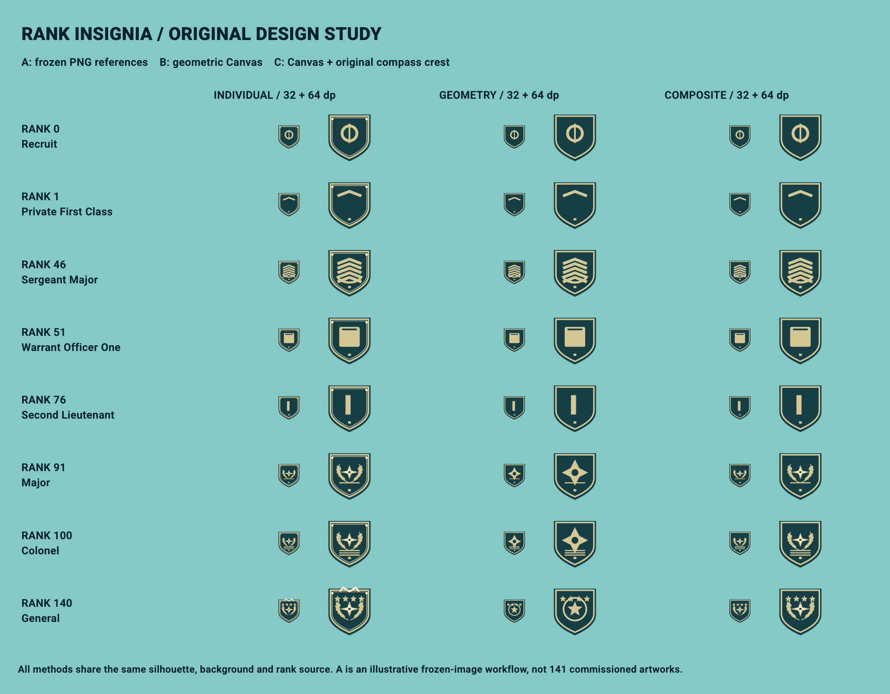
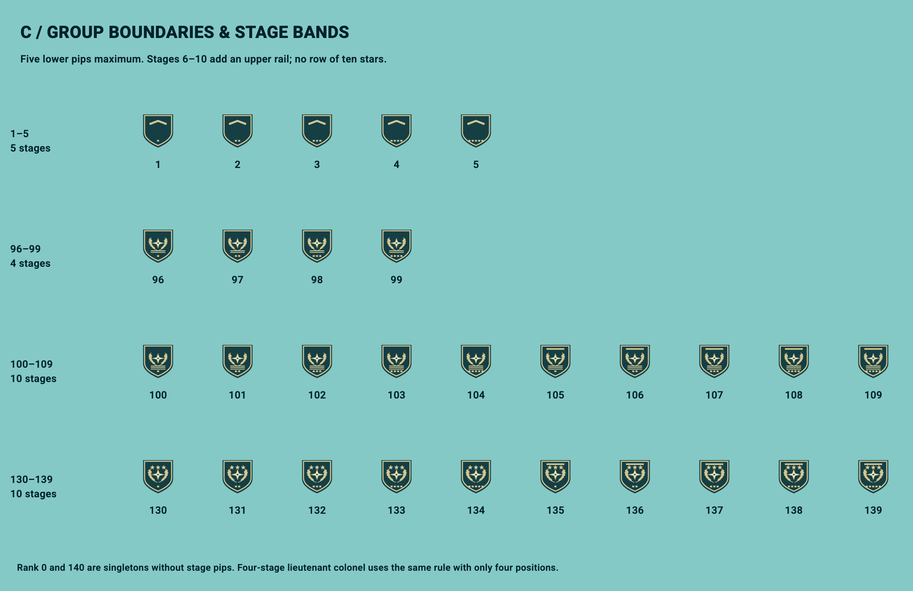
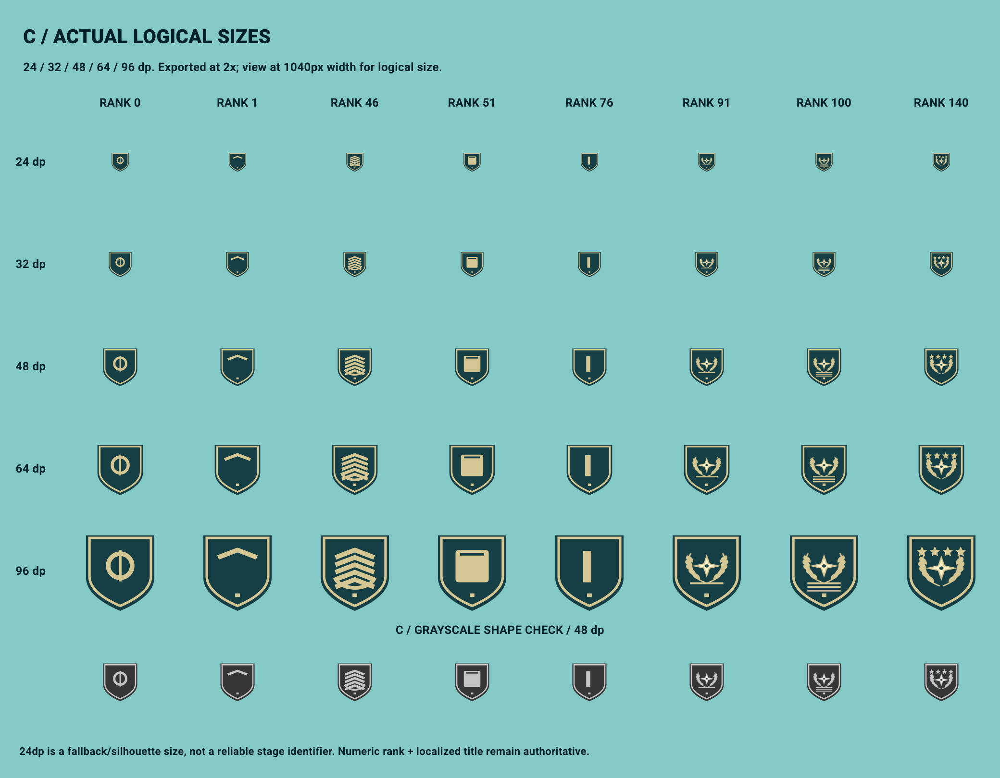
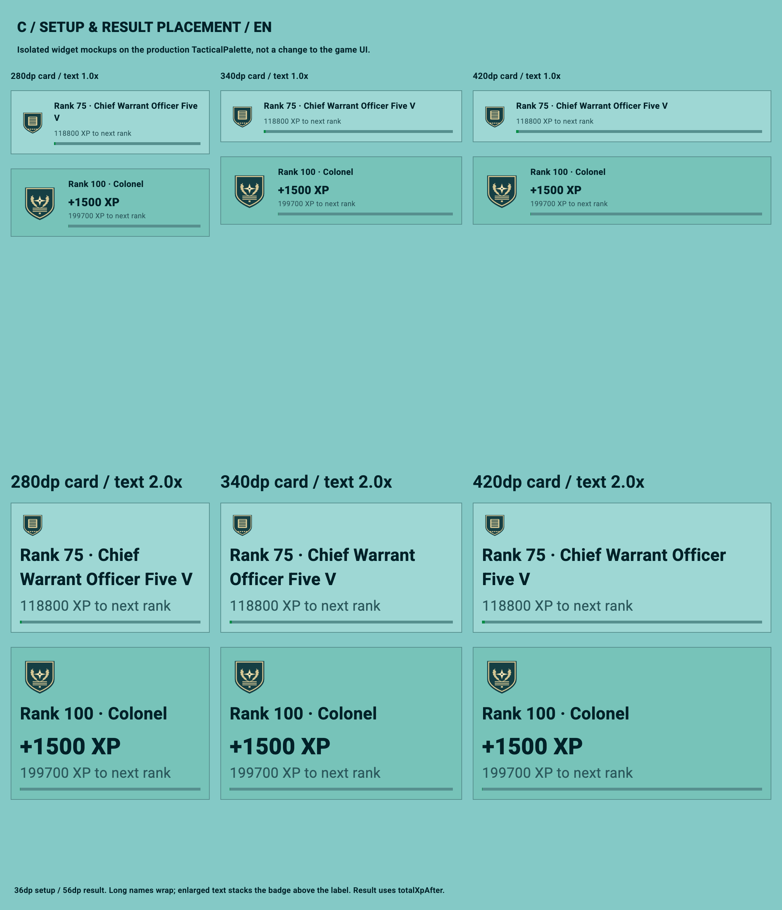
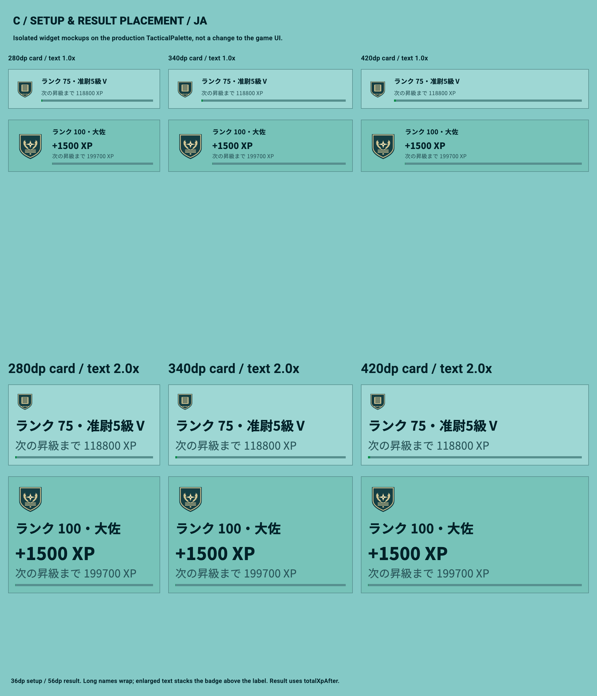

# Issue #124 — 階級章の方式比較・代表試作

対象: [#124](https://github.com/yuto90/conquest/issues/124)、比較元 `main@bee2d95`。Flutter 3.44.8 / macOS、2026-10-03。

## 結論とレビュー待ち

**C（基本図柄＋プログラム合成）を第一候補とする。単純な山形線・棒・段階マークはBのCanvas描画を使い、複雑な紋章だけ共有素材にする。** 141枚の個別制作を避け、海図風のコンパスと葉のモチーフを使えるため。配布方式はまずランタイム合成を候補とし、実機releaseプロファイルで問題があれば同じ正本からPNGを事前生成する。

これは採用決定ではない。**Draft PRのままユーザーの見た目確認を待つ。本番UI接続、全141点の完成制作、マージ、本番公開は行わない。** 技術的に描画できたことと、UIに適した美術品質は別に判断する。

朝の確認事項は、Cの平面・金属色の図柄で進めてよいか、Aのような個別装飾を増やしたいか。方式承認前に本実装Issueや制作作業へ進めない。

## 比較見本



- 代表階級: Rank **0 / 1 / 46 / 51 / 76 / 91 / 100 / 140**。
- 比較用コード・素材は `tool/rank_badge_study/` に隔離。本番コード・翻訳・依存・asset登録は変更していない。
- BF4から借りるのは系列ごとに図柄が変わり段階装飾が増える構造だけ。既存画像の転載・抽出・トレースはしていない。コンパスと葉は自作のCanvasパス。
- **Aも共通Canvasから出力した仮PNGであり、8点の独立した手描き完成品ではない。** 枠・リベット・最高階級の追加装飾を含む固定画像として表示を比較する。Aの写実的な金属・刺繍表現の上限や実制作時間を、このPoCで検証したとは扱わない。

| 方式 | 今回の正本・表示 | 強み | 残る負担・切替条件 |
| --- | --- | --- | --- |
| A: 全画像 | 代表8点の完成画像PNGを192pxで読み込む | 輪郭・装飾・陰影を個別に調整できる | 全141点にする場合は番号対応、欠落、画風の統一、再出力を管理。B/Cの見た目が承認されず、個別作画の予算を確保できる場合の代替 |
| B: プログラム | 正規化100×100座標の `CustomPainter` / `Canvas` / `Path` | 配色・線幅・寸法をまとめて変更、画像素材と追加依存が不要 | 葉・複雑な紋章を幾何学表現へ簡略化。図形だけの見た目が承認されるなら最小の代替 |
| C: 部品合成 | Bの枠・線・星・段階＋共有紋章PNG1点 | 素材点数を抑えつつ複雑な中央モチーフを使える | 透過縁・線幅・縮小時の濁りを確認。Cの紋章だけでは系列差が弱い場合は部品を追加するが、26グループ＝26元画像にはしない |

この試作ではCも単純な系列には画像を描かない。紋章はcommand/general系列だけで使う。Canvas記録が速いだけで、CがBより表示負荷も軽いとは判断しない（後述のラスタライズはCの方が遅い）。

## 141段階・26グループの対応

正本は既存の `RankCatalog.tiers` / `RankTitleKey` / `RankTier`。`BadgeSpec.fromRank` はタイトルキーの位置・既存グループの次の開始ランクから境界と段階数を導出する。XP表、保存データ、翻訳名の複製は作らない。

| 範囲 | 系列・グループ数 | グループ内段階 |
| --- | --- | --- |
| 0 | recruit: 1 | 1（段階マークなし） |
| 1–50 | enlisted: 10 | 各5 |
| 51–75 | warrant: 5 | 各5 |
| 76–90 | officer: 3 | 各5 |
| 91–109 | command: 3 | 5 / 4 / 10 |
| 110–139 | general: 3 | 各10 |
| 140 | general: 1 | 1（段階マークなし） |

合計26グループ、141段階。試作の6系列は図形を再利用するための分類であり、既存26グループを6グループに変更するものではない。グループは山形線数・下弧・棒の切り欠き・横線・星で区別する。グループ内は下部マーク最大5個、6–10段階は上部レールを追加する。4段階は4位置まで。Rank 0と140は別の図柄にする。



`test/rank_badge_study_test.dart` は全141ランクの境界・段階数・範囲外入力を確認する。B/Cの全141ランクを24/32/48/64/96dpで描画し、24px出力も空画像でないことを検査する。ただし全141点の美術レビューや小サイズでの全段階識別を証明するテストではない。

## 実寸・色・UI配置



画像はDPR 2で出力。`sizes.png` は**1040 CSS px幅**で表示すると指定logical dp相当（Retinaの実物理寸法や端末スクリーンショットではない）。ビューアの自動縮小表示だけで24/32dpを判断しない。

- 24dp: 葉・星・段階マークは潰れやすい。シルエット用途に限定し、正確な識別をバッジだけに任せない。
- 32–40dp: 設定カード候補。36dpを採用した配置見本で、階級名・XP・バーを残す。下部マークの個数は補助情報。
- 48–64dp: 結果領域候補。56dpの見本で、紋章・線・段階差を比較する。
- 96dp: 拡大見本。iPadでの実表示は未確認。
- C全体をグレースケール化した比較を用意。系列・段階は形状で変え、色の違いは使わない。ただし色覚シミュレーションと実機コントラスト検査は未実施。




既存 `TacticalPalette` / `TacticalTypography` と同じ背景・登録フォントに置いた**隔離widgetの配置見本**。既存設定・結果画面へ実装したスクリーンショットではない。横幅が240dp未満、または文字拡大時はバッジを上段に移し、長い英語階級名を省略せず折り返す。widget testでは160/320/390/768dp、英日、文字1倍/2倍でoverflow例外がないことを確認。

- 階級章は `ExcludeSemantics`。ランク番号＋ローカライズ済み階級名を隣接テキスト側から一度だけ読み上げる。Semanticsラベルの重複がないことをwidget testで確認。VoiceOver/TalkBackでの読み上げは未実施。
- 結果見本は既存 `GameResult.totalXpAfter` からランクを導出し、生きたproviderの現在値を参照しない。XPが0、またはXPスナップショットがない場合は何も追加しない。敗北・引き分け・XP 0勝利をテスト。
- 試作は静的表示。戦闘盤面、昇格アニメーション、新しい音・報酬処理は追加しない。
- `main@bee2d95` にはマイページの階級表示もある。本実装時に共通Widgetの利用先として整理するが、今回の設定・結果見本とは別の承認対象にする。

## ランタイム合成と事前書き出し

| 配布方法 | 素材・容量 | 表示時 | 更新方法 |
| --- | --- | --- | --- |
| Bランタイム | 画像0点、描画コードと装飾定義 | ベクターパスを描画。拡大で画像解像度を選ぶ必要がない | 共有色・線幅・座標を修正、再テスト |
| Cランタイム | 今回の共有PNG1点9,310 bytes＋描画コード | 紋章1枚を共有デコードし、必要な階級だけ合成。PNG部分は拡大限界がある | `paintCrestSource` と装飾定義を修正、共有PNG再生成 |
| A/B/Cの全階級PNG | 全141点×採用する解像度数。192px単一サイズの参考推定は後述 | 一度デコードして表示。合成パスは不要だが初回デコード・キャッシュメモリが必要 | 元データと出力サイズから一括再生成、rank番号の欠落・重複・差分を検査 |

CのPNGは192px正方形で、配置時は盾全体より小さい。96dpまでのPoC比較は用意したが、より大きい表示や高DPR対応は、素材の再出力サイズまたは元のベクターパス利用を再評価する。SVGは今回不要で追加依存なし。編集用SVGを採用するなら、最終PNGへの開発時変換で済むか、ランタイムSVGが必要かを先に決める。

ランタイム描画では正規化座標を使い、`shouldRepaint` はランクと描画入力の変更だけを見る。全141枚を一括デコードしない。画像欠落時もランクテキストは残し、PoCのPainterは汎用の幾何学表示へ戻る。実行時の画像生成API・外部通信・ネットワーク取得は不要。

## 測定値と限界

機械可読値: [metrics.json](issue-124/metrics.json)。同じ8代表、同じ192×192px（64dp・DPR 3相当）の透過PNGで比較。PNG/gzipは実測、141点の推定は8点平均×141であり**実測ではない**。将来の絵柄・サイズ・解像度数で変わる。PNGは既に圧縮されておりgzipの利益は小さい。

| 全体PNGを出力した場合 | 8点PNG合計 | 8点gzip合計 | 141点PNG推定 | 141点gzip推定 |
| --- | ---: | ---: | ---: | ---: |
| A | 91,279 B | 90,299 B | 約1.61 MB | 約1.59 MB |
| B | 60,560 B | 59,496 B | 約1.07 MB | 約1.05 MB |
| C | 69,524 B | 68,249 B | 約1.23 MB | 約1.20 MB |

上表のB/Cは**全体を事前出力する案**。ランタイムCが8枚・141枚のPNGを持つという意味ではない。共有紋章1点はPNG 9,310 B、gzip 9,218 B。

- 192px RGBA画像: 1枚147,456 B、8枚1,179,648 B、141枚全デコード20,791,296 B（約19.8 MiB）。幅×高さ×4の計算値であり、キャッシュ・GPUコピー・圧縮データ等は含まない。
- 192px PNGデコード30回: median **293µs** / p95 **454µs**。ファイル読取り・通信を含まず、毎回codecを破棄する。

| Rank 100・描画方式 | Canvas記録1,000回 median / p95 | offscreenラスタライズ30回 median / p95 |
| --- | ---: | ---: |
| A（デコード済みPNG） | 2 / 3 µs | 42 / 118 µs |
| B | 9 / 19 µs | 82 / 177 µs |
| C（デコード済み紋章） | 6 / 16 µs | 186 / 256 µs |

macOSのFlutter **debug widget test / offscreen**、10回の記録warmup後。`PictureRecorder` の記録と `Picture.toImage` の完了を別測定。Widgetのbuild/layout、画面合成、初回アセット読取り、releaseフレーム時間は含まない。端末性能の比較やフレーム予算達成を保証する値ではなく、測定のたびに変動する。全141点の実容量、iPhone/iPad実機・Simulatorの見え方、Webでの階級章描画、release CPU/GPU/メモリのプロファイルは**未実施**。Web releaseビルド成功は階級章のWeb性能検証ではない。

## 制作点数・工数・保守

- 現状: A代表8PNG、C共有紋章1PNG。B画像0。A/Cとも生成元は同じリポジトリのCanvasソース。全141点の完成制作はしていない。
- 本制作の候補: Bは共有形状6系列＋26グループ装飾定義、Cはそれに共有紋章1点を追加するところから開始。ユーザーが望む系列差に応じて元素材数を再評価。Aの完成画像は141点が必要。1×/2×/3×を別納品するなら423ファイルになるが、事前出力なら同一正本から生成する。
- 試作のコード量: 描画・仕様346行、配置見本122行、出力・測定517行、テスト209行（計1,194行、空行・importを含む）。出力・測定コードを本番へ持ち込む必要はない。
- **制作・手直し時間は未計測**。自動生成と共通コード調整を独立した手作画工数へ換算しない。全141点の所要時間も未見積り。品質承認後、単純形・複雑な紋章・最高階級の3点で作画と再修正を個別計時し、展開工数を見積もる。
- 配色・線幅: `badge.dart` の共有色とPaint幅を修正し、比較画像と固定PNGを再生成する。生成済みPNGだけの手修正は禁止。素材の編集元と再生成コマンドを必ず残す。
- 本実装で全141枚を事前出力する場合は、全カタログ反復、安定した命名、必要解像度、透過余白、manifest照合、不要/欠落検査を出力ツールに追加する。このPoCのexporterは代表8点用であり、完成版ツールではない。

## 承認後の作業分割と受入条件

1. **図柄・系列の確定**: 8代表と4/5/10段階の先頭末尾を実寸レビュー。32–40dp設定、48–64dp結果で承認。BF4素材は使用しない。全点制作に入る前にA/B/Cとランタイム/書き出しを決める。
2. **共通表示の本実装**: `RankTier → RankBadgeSpec → RankBadge → Painter / asset` を本番用に整理。全141段階・26グループ、Rank 0/140、英日の同じ図柄、欠落fallback、画像寿命、再描画条件をテスト。XP付与・DB書込みは表示責務へ混ぜない。
3. **設定・結果UI接続**: 既存文字・XP・バー・報酬条件・再戦を維持。結果は `totalXpAfter` のスナップショット。狭幅と2倍文字でoverflowなし、階級読み上げは一度だけ。マイページの利用先は別途確認。
4. **配布・端末QA**: iPhoneを主対象に、iPad・Web、複数DPR、VoiceOver/TalkBack、色覚/コントラストを確認。releaseで初回・再表示・ランク更新のフレーム時間と画像メモリを計測。予算未達なら正本を変えず事前PNG出力へ切り替える。

今回のPRは上記へ着手する許可ではなく、比較成果のレビュー待ち。Issueの「見た目についてユーザーの確認を受ける」は未完了として残す。

## 再現・検証

リポジトリrootから実行。既存のFVM・依存を使い、追加依存は不要。

```sh
export PATH="$HOME/.pub-cache/bin:$PATH"
fvm dart format --output=none --set-exit-if-changed tool/rank_badge_study test/rank_badge_study_test.dart
fvm flutter test --no-pub tool/rank_badge_study/capture_test.dart --reporter expanded
fvm flutter test --no-pub test/rank_badge_study_test.dart --reporter expanded
fvm flutter analyze --no-pub
fvm flutter test --no-pub --reporter expanded
fvm flutter build web --release --no-pub
```

専用テストと明示的exporterは計24テスト成功、analyze問題なし。通常の全テスト618件成功、Web releaseビルド成功。exporterは比較PNG・代表素材・metricsを上書きするため、明示的に実行する（通常の `flutter test` には含まれない）。タイミング再計測時はこの文書の実測値も更新する。

本番 `lib/`、XP表、ランク判定、永続保存、英日翻訳、結果・再戦処理は差分なし。試作素材は `pubspec.yaml` に登録せず、Web配布assetへ入れていない。端末操作によるE2Eや手動Preview確認はしていない。既存PR CIはVercel **Preview** を自動生成し得るが、Productionはmainへのpush条件。手動deploy、mainへのpush、マージ、本番公開は行わない。
